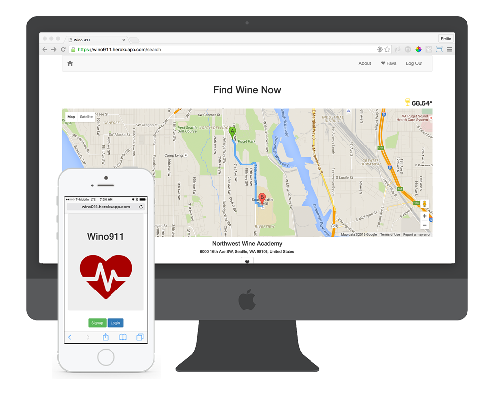

# Wino911
https://wino911.herokuapp.com/

**Wino911** helps you find a place that serves wine. Directions are provided to guide you to the closest destination so you can quench your thirst. If you like the place you can save it to your favorites list.
The local temperature display helps you decide whether you should drink red or white.  

  
Screenshots: 

# Technonlogy:
* *Node.js*, server
* *Express*, back-end app
* *PostgreSQL* & *Sequelize*, database set up
* *JavaScript*
* *bcrypt*, password encryption
* *express-session*, to remember a user between page loads

# APIs:
* Google Places
* Google Directions
* Forecast.io

# General Approach:
 I started with the wireframes and user flow. I focused on keeping the app streamlined and consciously decided to implement only a few features. After the wireframes were completed I created a basic Node.js app and required all of the needed modules. In my next step I planned out my database models thinking about datatypes, validations, associations and authentication. After the models were set up I tested for CRUD functionality. 
 The app features oAuth and RESTful routing. A user is able to sign up, login, logout, save favorite bars to a favorites list. 

# User Story & Wireframes:
I wanted to build a fun application utilizing google maps. As a wine lover and somebody that's always looking for a good wine bar I decided to build an app that would do just that.
Mock Up: https://ninjamock.com/s/Z2V8S

# Installation Instructions:
* Install the dependencies using npm install
* go to localhost:3000 or specify another port in index.js

# Improvements:
* favorites list can be accessed by all users (add hook to model and only display favorites belonging to that user)
* add proper error handling (password length reminder on sign up, incorrect password or username entry, user already exists)
* sign in user after sign up
* less Bootstrap & more CSS styling
* modify favorites list (add delete button & restyle)
* Goole Maps (add markers for more place options)
* add directions and routing only for places that user selects from the map

